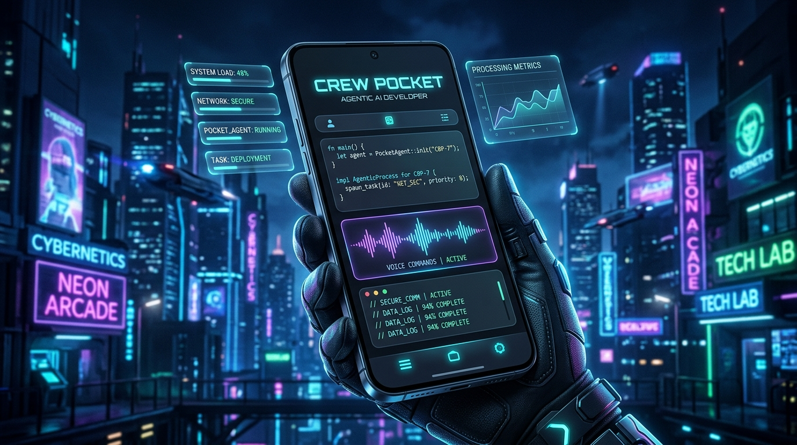

# Crew Pocket (口袋指揮 2.0) 🚀

<div align="center">



**Flagship Tactical Mobile AI Assistant running on Android Termux.**  
專為行動端量身打造的旗艦級隨身特工 AI 助理。

[](LICENSE)
[](https://termux.dev/)
[](#-雙-agent-provider)

</div>

---

## ⚡ 最小安裝（One-Line Quick Install）

打開 **Termux**，直接貼上並執行以下指令，即可完成所有依賴與環境設定：

```bash
curl -fsSL https://raw.githubusercontent.com/magic76/crew-pocket/main/install.sh | bash
```

安裝器只安裝核心執行環境（Node.js、Git、curl）與你選擇的 AI Provider；Python、Crew Helper 與瀏覽器 Extension 都是選配，不會阻塞基本文字對話。首次仍須親自完成 AI 帳號登入。

完成後依序執行：

```bash
crew doctor  # 一次檢查 Node、Provider、儲存權限、Helper 與 Web 服務
crew start   # 啟動服務並開啟 Crew Pocket
```

---

## 📱 隨身語音與無障礙操作助手 (Crew Helper APK)

專屬的 Android 隨身浮動球、Gemini Live 即時雙向語音通話與無障礙手指觸控輔助 App 已獨立為專用專案：
👉 **[Crew Helper Android APK 專案庫](https://github.com/magic76/crew-helper)**（可直接下載最新版 APK 安裝）

---

## 🌟 核心特色 (Key Features)

- 🌐 **原生無縫內嵌沙盒 2.0 (Seamless Inline Sandboxes)**：HTML / SVG / Web Audio / Chart.js 產物直接在對話中滿版動態渲染，高度智慧自適應，支援觸控互動、全螢幕大視野與代碼一鍵複製。
- 📱 **滿版極致視野 (Full-Width Top-Header Layout)**：捨棄傳統側邊頭像縮排，採用頂部精緻抬頭，釋放 100% 手機螢幕橫向空間，讓代碼與視覺組件更開闊。
- ⚡ **賽博朋克即時思考跑馬燈 (Cyberpunk Live Ticker)**：AI 思考推理（CoT）、工具呼叫（Tool Call）與文字生成脈絡即時滾動展示。
- 📦 **深度記憶提煉壓縮 (`/compact`)**：一鍵精簡長篇對話核心脈絡，同時無縫繼承上下文。
- 💬 **支線解答獨立卡片 (`/btw`)**：主副話題精準分離，可折疊收合，保持主線對話乾淨俐落。
- 🎙️ **Gemini 2.0 Flash Realtime 語音對話 (Live Mode)**：低延遲雙向 Web Audio PCM 即時語音串流，支援多種風格音色。
- 🧠 **思考強度自訂 (Thinking Effort)**：3 段式推理深度調節（`Low 極速` / `Medium 平衡` / `High 深度`）。
- 🤖 **雙 Agent Provider**：可在介面中切換既有的 **Antigravity / agy** 與可選的 **OpenAI Codex CLI**；兩者的對話、Session 與歷史紀錄完全隔離。
- 🧩 **持久 Codex 工作階段**：透過 `codex app-server` 常駐連線，支援串流回答、thinking、工具事件、檔案圖片輸入、模型清單、原生 context compaction 與對話回朔。
- 🔐 **Codex 全自動執行模式**：Codex 工作回合使用 `approvalPolicy: never` 與 `dangerFullAccess` sandbox，等效於非互動式全權限開發流程；請只在你信任的本機環境與專案中使用。
- 📈 **Context 與用量**：對話頁與歷史側欄顯示目前 context 用量；Codex 另提供前往 ChatGPT Codex 用量設定頁的連結。
- 🤖 **多模型選單**：Antigravity 提供既有模型；Codex 啟動後會由本機 CLI 動態讀取可用模型（例如 Sol、Terra、Luna）與其支援的 reasoning effort。
- 📎 **多模態相機與相簿附加**：支援 iPhone / Android 原生 **HEIC/HEIF** 解碼與 AI 視覺專用輕量自動壓縮。
- 📍 **GPS 即時定位與地圖**：一鍵獲取手機 GPS 並生成可於新分頁開啟的 Google Maps 導航卡片。
- 📁 **Termux 本地檔案總管**：行動端目錄導航、代碼預覽與直接送入 AI 對話。
- 📊 **模型用量監控 (`/usage`)**：即時掌握各模型重置週期與配額進度。
- 🛡️ **會話隔離與無損日誌引擎**：徹底杜絕多 Session 切換串台 Race Condition，並優先讀取完整日誌避免代碼截斷。

---

## 📲 Android Termux 安裝與環境設定指南

### 步驟 1：下載並安裝 Termux
> ⚠️ **重要提示**：請**勿**從 Google Play 商店下載（Play 商店版本已停止維護，無法正常更新套件）。

請選擇以下官方管道下載並安裝 Termux：
* 📥 **F-Droid 推薦下載**：[Termux on F-Droid](https://f-droid.org/en/packages/com.termux/)
* 📥 **GitHub Releases**：[Termux GitHub Releases](https://github.com/termux/termux-app/releases) *(下載 `termux-app_v..._universal.apk` 或對應您手機架構的 `arm64-v8a.apk`)*

---

### 步驟 2：初始化 Termux 環境與權限

打開 Termux App，依序執行以下指令：

```bash
# 1. 取得手機儲存空間存取權限（手機彈窗請點「允許」）
termux-setup-storage

# 2. 更新套件庫索引與系統套件
pkg update && pkg upgrade -y

# 3. 基本版只需要 Node.js、Git 與 curl
pkg install -y git nodejs curl
```

> Python 僅在需要本地 Python 程式沙盒時再安裝：`pkg install python`。

---

### 步驟 3：安裝 AI 核心引擎 (agy / codex)

Crew Pocket 支援雙核心 AI 引擎，請依需求安裝：

#### 🔹 核心 A（預設必裝）：Google Antigravity CLI (`agy`)
Antigravity (`agy`) 是 Crew Pocket 的預設核心，具備高效率代碼編輯、多模態視覺與上下文記憶管理能力。

```bash
# 1. 全域安裝 Antigravity CLI
npm install -g agy

# 2. 驗證安裝
agy --version

# 3. 首次啟動並完成 Google 帳號授權登入
agy
```
> 💡 **Android 登入小提示**：首次啟動 `agy` 若 Termux 未自動喚醒瀏覽器，請長按複製終端中顯示的 OAuth 授權網址，貼到手機 Chrome/Edge 中完成登入，完成後回到終端按 `Ctrl+C` 結束 TUI 即可。
> 若 Crew Pocket 顯示「AGY 登入已過期」，請在 Termux 互動執行一次 `agy` 完成重新授權；Web 服務會暫停重複 prewarm，避免失敗程序持續重啟。

#### 🔹 核心 B（可選擴充）：OpenAI Codex CLI (`codex`)
若您希望在模型選單中無縫切換到 OpenAI Codex 系列模型（如 Sol、Terra、Luna 等），請安裝 Codex CLI：

```bash
# 1. 安裝 Termux 專用優化版 Codex CLI（Android arm64 環境推薦）
npm install -g @mmmbuto/codex-cli-termux

# 2. 驗證安裝
codex --version

# 3. 登入 OpenAI / ChatGPT 帳號
codex login
```
> 💡 **Codex 登入小提示**：Codex 採用 Device Code 模式，執行 `codex login` 後終端會顯示短網址與 8 位驗證碼，用手機瀏覽器打開輸入代碼即可秒速完成授權。

> 🧠 **為什麼先裝 agy 再裝 codex 很順暢？**  
> Android 系統採用特有的 Bionic Libc 架構。在完成步驟 2 的環境配置與 `agy` 初始化後，Termux 的底層開發工具鏈（Node.js、Python、儲存權限與全域路徑）已全部鋪平。加上 `@mmmbuto/codex-cli-termux` 是社群專門針對 Android arm64 修補過動態連結庫（LD_LIBRARY_PATH）的版本，因此後續安裝其他 CLI 引擎會非常順暢！

---

### 步驟 4：下載 Crew Pocket 專案

在 Termux 終端中複製本專案：

```bash
git clone https://github.com/magic76/crew-pocket.git ~/agy-web
```

### 步驟 4.1：AI 助理專案規範

本 repo 已包含 [`GEMINI.md`](GEMINI.md) 與 [`AGENTS.md`](AGENTS.md)。使用 Antigravity CLI (`agy`) 或其他支援專案指令檔的 AI agent 時，請從專案根目錄啟動，讓它讀取這些規範後再修改程式：

```bash
cd ~/agy-web
agy
```

規範包含 Termux 執行安全、Mobile-first UI、HTML 沙盒、Chart.js、手機裝置能力，以及子代理協作規則（任務拆分、唯讀優先、避免同檔衝突、主代理統一整合與 commit／push）與工具效率規範（無明確要求不使用外部搜尋、批次讀取、單次修改與集中測試）等專案慣例；請保留在 fork 或部署副本中，避免 AI 修改時忽略 Crew Pocket 的既有行為。

### 步驟 4.2：安裝 Android Crew Helper (隨身語音與觸控助理)

Android 隨身浮動球、相機、螢幕分享與無障礙服務的原始碼已獨立為專屬專案：
👉 **[Crew Helper 開源倉庫 (magic76/crew-helper)](https://github.com/magic76/crew-helper)**

您可以直接前往該倉庫的 [Releases 頁面](https://github.com/magic76/crew-helper/releases/latest) 下載最新已簽署的 APK 進行安裝。

### 步驟 4.3：Crew Pocket Browser Extension

`extensions/crew-pocket-bridge/` 是 Crew Pocket 的瀏覽器橋接套件，適用於 Lemur Browser 等支援 Chromium Extension 的 Android 瀏覽器。它能把目前網頁的 DOM、截圖、網路請求與除錯資訊送到 Crew Pocket，並透過本機 Bridge Server 接收 AI 指令。

套件壓縮檔位於 [`extensions/crew-pocket-bridge/crew-pocket-bridge.zip`](extensions/crew-pocket-bridge/crew-pocket-bridge.zip)。在瀏覽器的擴充功能頁面匯入或解壓後載入此目錄即可；Bridge 已整合進 Crew Pocket 主服務，啟動 `node ~/agy-web/server.js` 後會自動提供 `ws://127.0.0.1:8000/api/extension/ws`。

Extension、Web UI 與 AI API 統一走 `127.0.0.1:8000`；Android Crew Helper 的 `8766` 僅作為 Crew Pocket 的內部本機服務，不需手動操作，也不會對區網開放。

---

## 🚀 啟動與使用 (Usage)

### 1. 啟動 Web 服務
```bash
cd ~/agy-web
node server.js
```
*或是使用安裝器建立的指令：`crew start`。*

### 2. 打開手機瀏覽器
在手機瀏覽器輸入網址：
```
http://127.0.0.1:8000
```

### 3. 📱 升級為全螢幕 App（PWA）
1. 在手機 Chrome / Edge / Safari 瀏覽器打開 `http://127.0.0.1:8000`。
2. 點選瀏覽器選單（右上角或底部的 `⋮` / 分享按鈕）。
3. 點擊 **「加到主畫面」 (Add to Home screen)** 或 **「安裝應用程式」**。
4. 手機桌面即會產生 **Crew Pocket** 專屬圖標，點開即享沉浸式無邊框 App 體驗！🎉

### 安裝後自我檢查

```bash
crew doctor
```

它會顯示 Node.js、Crew Pocket 目錄、agy/Codex 是否已安裝、儲存空間授權、選配 Crew Helper 連線與目前 Web 服務狀態。Provider 的帳號登入是外部 OAuth 流程，請依提示執行 `agy` 或 `codex login` 完成。

---

## ⌨️ 快捷指令清單 (Slash Commands)

| 指令 | 功能說明 | 適用場景 |
| :--- | :--- | :--- |
| `/compact [焦點]` | **對話記憶精簡壓縮** | 當對話太長、Token 消耗過多時，提煉核心脈絡並釋放記憶 |
| `/btw [問題]` | **順帶一提 · 支線解答** | 在主線討論中插入短小問題，生成獨立折疊卡片 |
| `/clear` | **一鍵清空開新對話** | 快速重置目前對話上下文 |
| `/plan [目標]` | **自主架構規劃模式** | 複雜多模組專案逐步拆解 |
| `/goal [目標]` | **自主特勤目標達成** | 高難度、長時程任務不達目的不停止 |

> `/compact` 依目前 Provider 執行：AGY 使用 Crew Pocket 的既有記憶摘要機制；Codex 使用 CLI 原生的 context compaction。

### `/compact` 歷史留存驗證（AGY）

1. 在同一個對話先傳送兩則有辨識度的訊息，例如「驗證 A」與「驗證 B」，再執行一次 `/compact`。
2. 再傳送「驗證 C」與一張照片，執行第二次 `/compact`。
3. 重新整理頁面、切換到另一個歷史對話後再切回來；A、B、C 與照片訊息都必須仍在，且只會多出 checkpoint 分隔卡。

AGY 每次 compact 前會把 active `transcript.jsonl` 的新增 records 依完整紀錄身分去重後封存進 `transcript_full.jsonl`；compact 只縮小模型工作快照，不會刪除 Web 歷史。

---

## 🧩 Provider 與對話資料

| Provider | 預設狀態 | 對話與 Session | 特有能力 |
| :--- | :--- | :--- | :--- |
| Antigravity / agy | 預設，原有行為不變 | 既有 resident session 與本機 brain 歷史 | `/compact` 記憶摘要、`/usage` 用量彈窗、Gemini Live 語音 |
| OpenAI Codex | 可選 | `codex app-server` thread，與 AGY 完全隔離 | 動態模型、工具／reasoning 串流、context 用量、原生 compact、回朔到任一使用者回合 |

切換 Provider 不會遷移、覆寫或刪除另一個 Provider 的對話。左側歷史列表會以 `AGY` 或 `Codex` 標籤區分來源。

Codex context 用量由 app-server 在工作回合中回報；伺服器剛重啟時，舊 Codex 對話可能先顯示 `—`，完成新的 Codex 回合後即會更新。

---

## 🛠️ 技術架構 (Architecture)

- **後端 (Backend)**: Node.js 原生 HTTP + Server-Sent Events (SSE)；Provider 層將 AGY resident process 與 Codex app-server 事件正規化後送往前端
- **Provider**: `lib/providers/antigravity.js` 保留既有 AGY 實作；`lib/providers/codex.js` 管理持久 JSON-RPC app-server 與 Codex thread
- **前端 (Frontend)**: 原生 Modular JavaScript (`app.js`, `chat.js`, `tools.js`, `ui.js`, `live.js`) + Tailwind CSS (Glassmorphism 2.0)
- **安全防護 (Security)**: DOMPurify 離線安全消毒 + 沙盒化 Iframe 隔離執行
- **格式支援 (Formats)**: Marked.js + Highlight.js + heic2any + Chart.js
